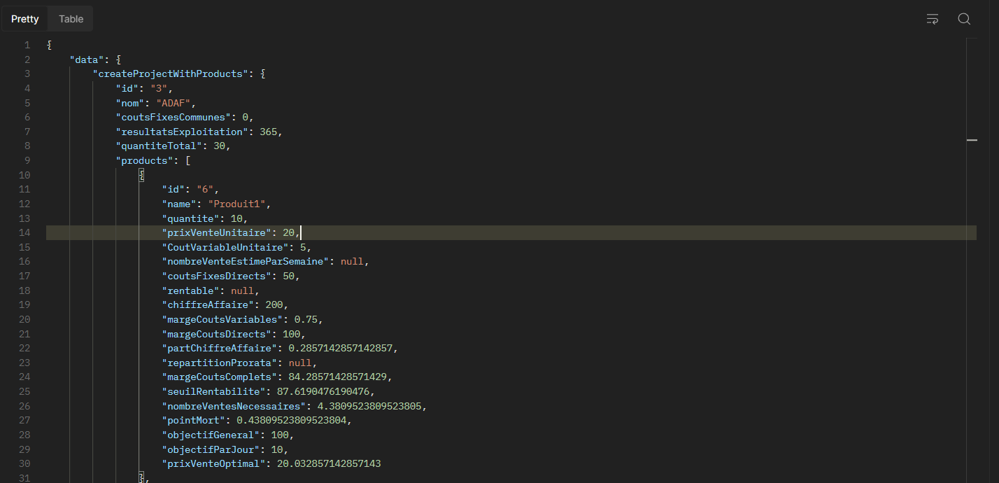
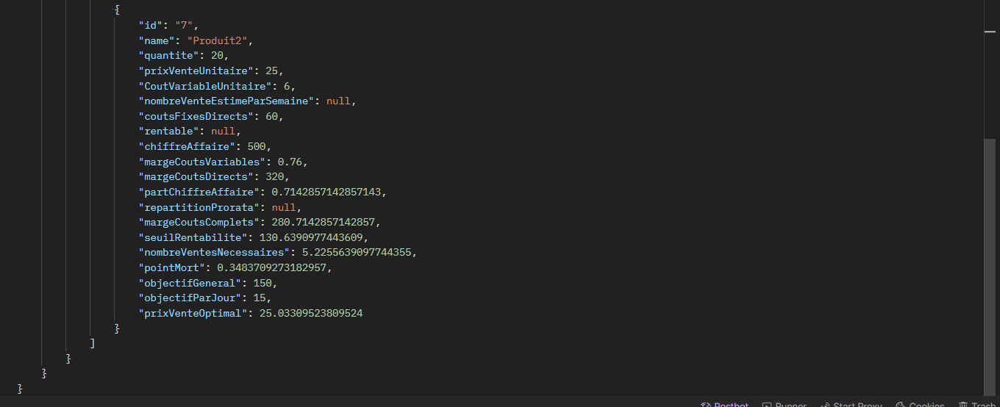
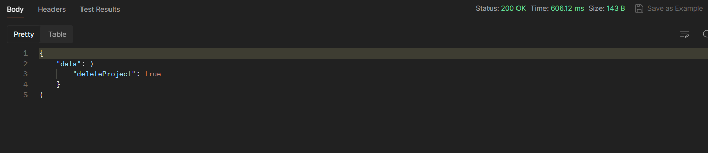
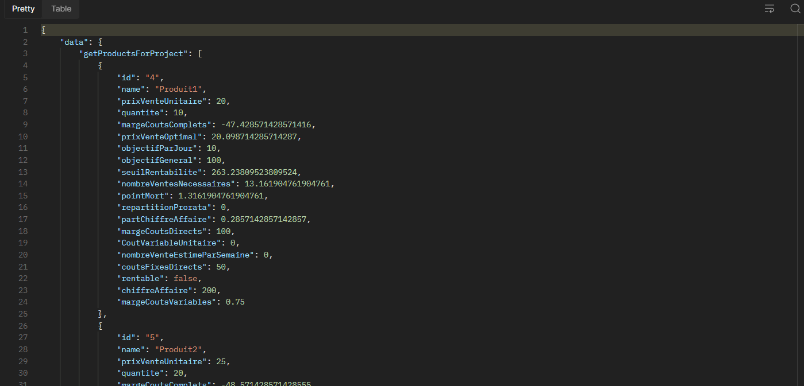

# Analyse de Performance des Projets avec la Comptabilité Analytique

Ce projet personnel vise à fournir une plateforme d'analyse de performance des projets basée sur les principes de la comptabilité analytique. Il permet d'évaluer la rentabilité des projets en analysant diverses données telles que les charges de loyers, les coûts des products, les coûts de maintenance des machines, les ventes par jour, etc.

## Technologies Utilisées

- **Backend:** Java Spring Boot
- **Frontend:** Angular
- **Base de Données:** MySQL

## Fonctionnalités Principales

- Collecte de données sur les charges, les coûts, les ventes, etc. pour chaque projet.
- Analyse des performances des projets à travers des calculs basés sur les données collectées.
- Détermination du prix de vente optimal pour chaque product.
- Prédiction du moment où un projet deviendra rentable.
- Interface graphique conviviale pour visualiser les résultats de l'analyse.

## Caractéristiques Techniques

- Utilisation de la programmation orientée aspect (AOP) avec Spring AOP pour encapsuler la logique transversale.
- Implémentation de contrôleurs REST et GraphQL pour une interaction flexible avec les clients.
- Utilisation de mappings pour la réception des requêtes et le retour des résultats aux clients.
- Gestion centralisée des erreurs avec `@RestControllerAdvice` et `@ExceptionHandler` pour une meilleure robustesse.
- Utilisation de Mapstruct pour faire des mappings entre les Data Transfer Objects.

## Prérequis
- Serveur de base de données MySQL
- Java 11 ou plus
## Guide d'Utilisation

1. Clonez le dépôt du projet.
2. Configurez votre base de données MySQL si nécessaire sur application.yml (il faut créer une base de données avec le nom 'project_plan')
3. Exécutez la commande 'mvn clean install' pour télécharger les dépendances nécessaires.
4. Exécutez le frontend Angular (existe dans le répertoire angular-app).
5. Vous pouvez lancer l'exécution de l'application à l'aide d'un éditeur de code (IntelliJ ou Eclipse) ou bien en ligne de commande en tapant mvn springboot:run .

## Quelques exemples de requêtes GraphQL
```
mutation CreateProjectWithProducts {
    createProjectWithProducts(
        input: { 
            nom: "Project1", 
            chargeFixesCommunes: 485.88, 
            products: 
            [
                {
                    name: "Produit1",
                    quantite: 10,
                    prixVenteUnitaire: 20.00,
                    coutVariableUnitaire: 5.00,
                    coutsFixesDirects: 50.00,
                    objectifGeneral: 100,
                    objectifParJour: 10
                },
                {
                    name: "Produit2",
                    quantite: 20,
                    prixVenteUnitaire: 25.00,
                    coutVariableUnitaire: 6.00,
                    coutsFixesDirects: 60.00,
                    objectifGeneral: 150,
                    objectifParJour: 15
                }
            ]
        } 
    ) 
    {
        id
        nom
        coutsFixesCommunes
    }
}
```




```
mutation DeleteProduct {
    deleteProduct(projectId: 1, productId: 3)
}
```


```
query GetProductsForProject {
    getProductsForProject(id: 1) {
        id
        name
        prixVenteUnitaire
        quantite
        margeCoutsComplets
        prixVenteOptimal
        objectifParJour
        objectifGeneral
        seuilRentabilite
        nombreVentesNecessaires
        pointMort
        repartitionProrata
        partChiffreAffaire
        margeCoutsDirects
        CoutVariableUnitaire
        nombreVenteEstimeParSemaine
        coutsFixesDirects
        rentable
        chiffreAffaire
        margeCoutsVariables
    }
}
```

## Contributions

Les contributions sont les bienvenues! Si vous avez des idées d'amélioration ou si vous souhaitez signaler un problème, n'hésitez pas à ouvrir une issue ou à soumettre une pull request.

---

En intégrant des concepts innovants de programmation et en offrant une interface utilisateur conviviale, ce projet vise à fournir une solution puissante pour l'analyse de performance des projets basée sur la comptabilité analytique.
